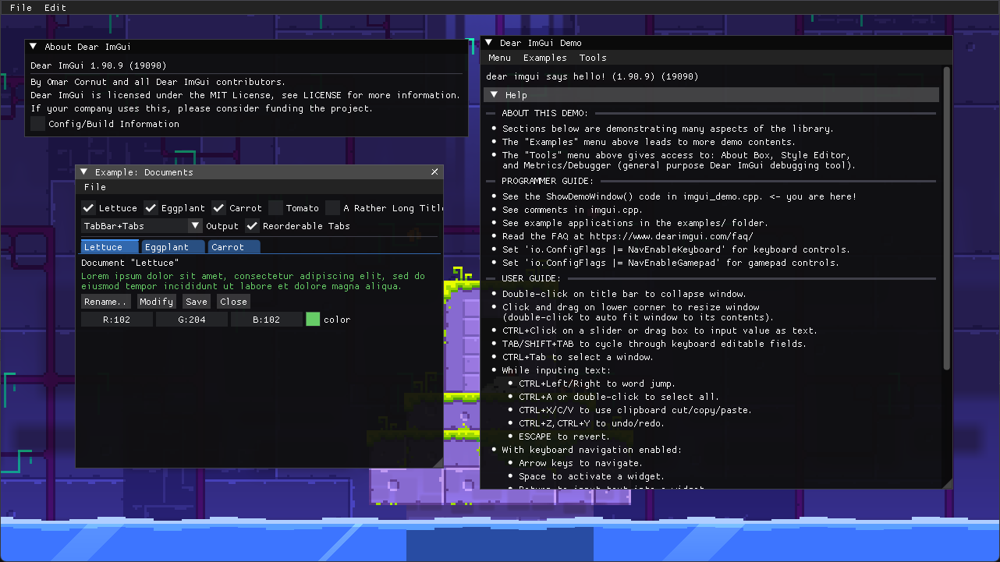

# IMGUI



*After all, all game developers now use ImGui everywhere, right?*

## Overview

This is a FEZ mod for integrating the ImGui.NET wrapper of Dear ImGui.

## Purpose

This mod is primarily intended for those who want to have some kind of UI
for their mod (could be an editor, control panel, debugging tool, etc.).

## Usage

Use `ImGui` static class from the `ImGuiNET` namespace.

Additionally, the `ImGuiX` static class is provided for more fluent usage with XNA types. 

## Installation

1. Install [HAT](https://github.com/FEZModding/HAT) via the instructions there.
2. Download `IMGUI.zip` from [Releases](https://github.com/zrckr/IMGUI/releases/latest) page
   and extract it in the `Mods` directory as a folder.
3. Run `MONOMODDED_FEZ.exe` and enjoy!

## Referencing

To use this mod in your mod, you need to add references to `IMGUI.dll` in these files:

* `UserProperties.xml`:

```xml
<Project>
   <PropertyGroup>
      ...
      <!--Insert path to where IMGUI mod is here-->
      <ImGuiDir></ImGuiDir>
   </PropertyGroup>
</Project>
```

* `YourMod.csproj`:

```xml
<Project Sdk="Microsoft.NET.Sdk">
   ...
   <!-- To use ImGuiX helper class -->
   <Reference Include="IMGUI">
      <HintPath>$(ImGuiDir)\IMGUI.dll</HintPath>
      <Private>False</Private>
   </Reference>
   
   <!-- To use ImGuiNET namespace -->
   <Reference Include="ImGui.NET">
      <HintPath>$(ImGuiDir)\ImGui.NET.dll</HintPath>
      <Private>False</Private>
  </Reference>
</Project>
```

## Building

1. Clone the repository.
2. Include game references in the [UserProperties.xml](UserProperties.xml) file.
3. Build it with your IDE of choice or with `dotnet` command.

## Versioning

The mod follows the versioning scheme: `<UPSTREAM>.<REVISION>`

* `UPSTREAM`: the version of native `Dear ImGui`.
* `REVISION`: in case of bug fixes or implementation improvements.

## Contributing

**Contributions are welcome!** Whether it's bug fixes, implementation improvements or suggestions,
your help will be greatly appreciated.

## Special thanks

- [Krzyhau](https://github.com/Krzyhau) - for the method of loading native dependencies used in [HEADSET](https://github.com/Krzyhau/HEADSET) mod.

## See also

https://github.com/ImGuiNET/ImGui.NET

> This is a .NET wrapper for the immediate mode GUI library, Dear ImGui (https://github.com/ocornut/imgui).
> ImGui.NET lets you build graphical interfaces using a simple immediate-mode style. ImGui.NET is a .NET Standard
> library, and can be used on all major .NET runtimes and operating systems.

https://github.com/ocornut/imgui

> Dear ImGui is a bloat-free graphical user interface library for C++. It outputs optimized vertex buffers that you can
> render anytime in your 3D-pipeline enabled application. It is fast, portable, renderer agnostic and self-contained
> (no external dependencies).

> Dear ImGui is designed to enable fast iterations and to empower programmers to create content creation tools and
> visualization / debug tools (as opposed to UI for the average end-user). It favors simplicity and productivity toward
> this goal, and lacks certain features normally found in more high-level libraries.

> Dear ImGui is particularly suited to integration in games engine (for tooling), real-time 3D applications, fullscreen
> applications, embedded applications, or any applications on consoles platforms where operating system features
> are non-standard.

See the [official screenshot thread](https://github.com/ocornut/imgui/issues/123) for examples of many different kinds
of interfaces created with Dear ImGui.

https://github.com/cimgui/cimgui

> This is a thin c-api wrapper for the excellent C++ intermediate gui imgui. This library is intended as an intermediate
> layer to be able to use imgui from other languages that can interface with C.
